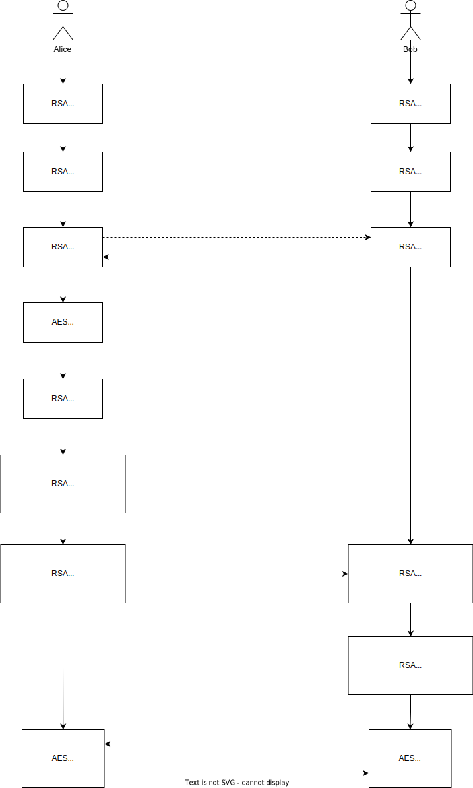

# Trabalhando com criptografia simétrica e assimétrica

## O objetivo 
Este repositório tem por objetivo demonstrar de forma simples o fluxo de comunicação segura
utilizando criptografia simétrica e assimétrica

## Referencias

- https://medium.com/b2w-engineering/compartilhando-chaves-aes-utilizando-rsa-com-openssl-3beffb1b2010
- https://zeroandrade.com.br/como-criptografar-arquivos-com-openssl.html
- https://sleeplessbeastie.eu/2021/05/12/how-to-encrypt-or-decrypt-files-using-openssl-utility/